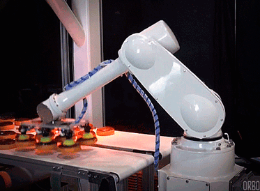

# Prism Long Term Storage

Prism long term storage is meant to propagate data from our customers through the Prism architecture into a storage area for an infinite period of time.

## How does `prism-long-term-storage` work?

Prism long term storage uses the AWS S3 connector for Kafka Connect to route data from our Kafka cluster into AWS S3. Customer data is ingested by a Kafka Producer and Kafka Connect functions as a Kafka Consumer.

### Partitioning

We are using a custom partition scheme forked from the Hellfish's team `RallySoftware/schwartz-kafka-connect` repo. This uses the `metric_date` field in each incoming Avro message to route these messages to a particular S3 bucket and file. Each S3 file contains a `flushSize` number of Avro records for that particular day. For instance, with a `metric_date` of `2018-01-04`, each record will be routed to a file in the bucket: `s3://prism-lts/topics/ac-user-event/year=2018/month=01/day=04/`. The flush size can be any number that is reasonable. We are starting with a flush size of 250 as a default value. This can be updated in `prism-lts/values.yaml`.

## Local Development

### Initial Setup

- `minikube start`
- Setup AWS secrets, with `kubectl create secret generic aws-s3-creds --from-file ~/.aws/credentials`
- Setup Quay credentials, go to `https://quay.io/organization/stsatlas?tab=robots`, select `stsatlas+platform_deployer` and follow the directions for Kubernetes Secret
  - Rename the secret (in the file downloaded) to be `quay-sts`
  - Run `kubectl create -f /path/to/stsatlas-platform-deployer-secret.yml`
- Install helm with `brew install kubernetes-helm`
- Run `helm init`
- Get dependencies for prism-lts by running `helm dep update prism-lts && helm dep build prism-lts` from the root of this project

### Updating the `local-kafka` chart or `local-charts` [environment specific] values

If you update any environment specific values or the local kafka chart, you will need to update and build dependencies in prism-lts again.

- Run `helm dep update`
- Run `helm dep build`

### Testing Prism-lts

- Run `./bin/kafka-connect-test`
- NOTE: requires `$QUAY_USERNAME` and `$QUAY_PASSWORD` to be set OR the `quay-sts` secret.
- NOTE: requires `$AWS_ACCESS_KEY_ID` and `$AWS_SECRET_ACCES_KEY` to be set OR the `aws-s3-creds` secret.

### Running Prism-lts

`<release_name>` is how you will refer to your installation of the helm chart in your local cluster.
- Your first run will use the command: `helm install --replace --name=<release name> ./prism-lts --set tags.prism-lts-local-values=true`
- After the first run, use the command: `helm upgrade --install <release_name> ./prism-lts --set tags.prism-lts-local-values=true`

### Testing Prism-lts

Run './bin/kafka-connect-test'.

### To Send Data to the REST Proxy
- setup port forwarding for the local kafka rest proxy: `kubectl port-forward $(kubectl get po -o name -l app=local-kafka-rest --sort-by='.metadata.creationTimestamp' | cut -d \/ -f 2 | tail -n 1) 8082:8082`
- view the logs with: `kubectl logs $(kubectl get po -o name -l app=prism-lts --sort-by='.metadata.creationTimestamp' | cut -d \/ -f 2 | tail -n 1)`
- finally, run: `./bin/send_a_bunch_of_data <topic name> <desired num messages>` to send a bunch of messages onto the local kafka bus

### Updating the Kafka Connect Docker Image

- `eval $(minikube docker-env)` to change docker contexts to minikube
- go to the [sts-atlas/schwartz-kafka-connect](https://github.com/sts-atlas/schwartz-kafka-connect) repo.
- build the `sts-atlas/schwarz-kafka-connect` jar using `lein uberjar` in that repo.
- copy the jar to the `prism-long-term-storage` repo.
  - NOTE: ensure that the file is renamed to `schwartz-kafka-connect.jar`.
- run `docker build . -t quay.io/stsatlas/schwartz-kafka-connect:<your git SHA> -f DockerfileSchwartzKafkaConnect` to build the docker image
- use `docker push quay.io/stsatlas/schwarz-kafka-connect:<your git SHA>` to push the docker image
- update `prism-lts/values.yaml`

### Updating the Curl Docker Image (used by the kafka connect jobs)

- `eval $(minikube docker-env)` to change docker contexts to minikube
- `docker build . -f DockerfileCurl -t quay.io/stsatlas/bash-curl:<your git SHA>` to build the new docker image
- `docker push quay.io/stsatlas/bash-curl:<your git SHA>` to push the docker image
- update `prism-lts/values.yaml`

### Changing metadata labels or annotations
If you change metadata labels or annotations, helm does not know that the previous release running in your minikube cluster is the same app.
Delete your old release by running `helm delete <release_name> --purge`
The `--purge` flag removes references that helm has to track your release.
